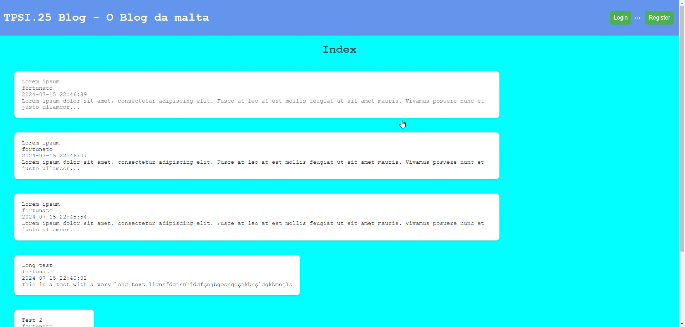

# LENIC

Lenic is a bonafide social network where users are able to:
- follow each other
- make posts (private and public) to their feed
- comment on each others posts
- add pictures to their user profile and posts for further personalization
- search for users
- receive notifications related to activity relevant to them
- send and receive DMs

Want to give it a spin inside your work network? Thought wou might... ;P

## Requirements:

You'll need:
- Docker
- The [mailer_sender](https://github.com/Anacardo89/mailer_sender) service

## Setup:

Although no recommended you can leave the setup files as they are and the container will run correctly.
- setup config files in `config` directory as wall as `docker-compose.yaml`
- run `setup.sh`
- test if the landing page loads `localhost:8082` on default configs
- run [mailer_sender](https://github.com/Anacardo89/mailer_sender) service (or don't and activate users manually in DB)
- have fun with your co-workers

There's also a [gRPC API](https://github.com/Anacardo89/lenic_api) that let's you interact with the app. Why you would want do that... Well, i don't know, i mostly made for learning points. :)
