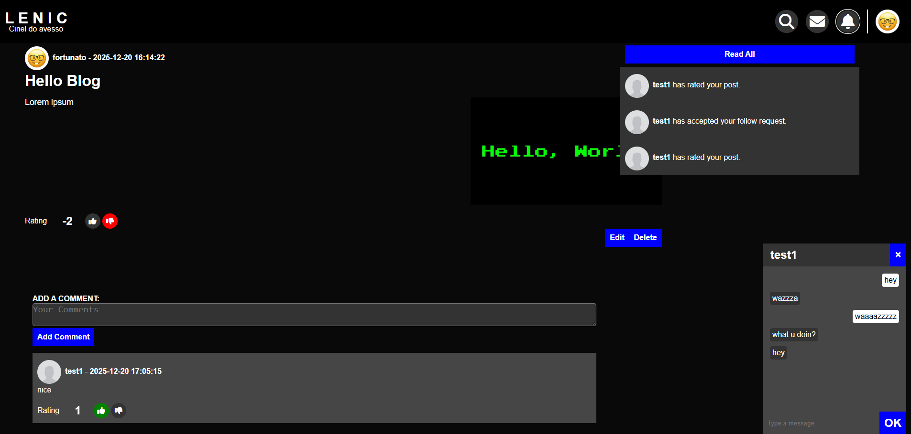

# [Lenic - Social Network](http://ec2-35-181-166-192.eu-west-3.compute.amazonaws.com/home)


## Overview & Features

**Lenic** is a social network where users can:
- Make public or private posts and comment on others’ posts
- Rate both posts and comments up or down
- Request to follow other users and gain access to their private posts
- Send direct messages (DMs) to other users
- Tag users in posts or comments
- Receive notifications for relevant activity

The project started as an experiment in serving HTTP with Go’s HTTP templates and gradually evolved into a playground for testing new technologies in a real environment. As a result, the current version is a monolith: the frontend is tightly coupled with the backend, and the API is not fully RESTful (it returns 200 responses and refreshes the page on success).

Originally, email handling for account activation and password recovery was a separate service, communicating with RabbitMQ. For deployment simplicity and AWS free-tier constraints, it is now incorporated into the main service.

The project features:
- **Database migrations** and a separate migration runner under `/cmd/migrate`
- **Simple loading** for both AWS and Docker environments
- **Tested database repository** using Testcontainers for reliable integration testing

The deployment to AWS is a major milestone, but the project is ongoing. Planned improvements include:
- Adding HTTPS/TLS support for secure requests
- Separating the frontend and API layers

## Project Structure
```
.
├── cmd                     # Command-line entry points
│   ├── main                  # Main application
│   └── migrate               # Database migration runner
├── config                  # Configuration files and models
├── db                      # Database migrations, seeds, and users
│   ├── migrations            # SQL migration scripts
│   ├── seeds                 # Seed data for testing
│   └── users                 # User-specific migration/runner SQL
├── docker                  # Dockerfiles
├── frontend                # Frontend assets and templates
│   ├── static                # Static assets: CSS, JS, images
│   └── templates             # HTML templates
├── internal                # Core application code
│   ├── auth                  # Authentication logic
│   ├── helpers               # Utility helpers
│   ├── middleware            # HTTP middleware (auth, logging, timeout)
│   ├── models                # Domain models and adapters
│   ├── repo                  # Database repository
│   ├── server                # Server and router
│   │   ├── httphandle          # HTTP handlers
│   │   │   ├── api               # API handler
│   │   │   ├── page              # Page handler
│   │   │   └── redirect          # Handlers for HTTP redirects
│   │   └── wshandle            # WebSocket handler
│   ├── session               # Session management
│   └── wsconnman             # WebSocket connection manager
├── pkg                     # Reusable packages
│   ├── crypto                # Password hashing
│   ├── db                    # DB connection and utilities
│   ├── img                   # Image handling
│   ├── logger                # Custom logger (wraps aroung slog)
│   ├── mail                  # Email handling
│   └── testutils             # Testing helpers
├── docker-compose.yaml     # Docker Compose setup
├── sample_aws.env          # Sample AWS environment variables
├── sample.env              # Sample docker environment variables
├── lenic.service           # Systemd service unit for running app as a background service
├── lenic-migrator.service  # Systemd service unit for running DB migrator
└── manual_deploy_steps.md  # Manual deployment instructions
```

## Setup

### Docker
Follow these steps to run the app locally and execute the tests.

#### 0. Prerequisites
- [Docker](https://www.docker.com/) and [Docker Compose](https://docs.docker.com/compose/)
- [Go](https://go.dev/dl/) 1.25.0+ installed (for running tests locally)

#### 1. Clone the repository and navigate inside it
```bash
git clone git@github.com:Anacardo89/lenic.git
cd lenic
```

#### 2. Copy .env from provided sample
```bash
cp sample.env .env
```

#### 3. Edit .env file with email information
While for the most part the default config can be used, the system does rely on authentication with Gmail [App password](https://myaccount.google.com/apppasswords).
- Get the app password
- edit `sample.env` `MAIL_USER` and `MAIL_PASS` with the correct info  

**OR**  

Alternatively you can bypass the email verification by manually changing the `is_active` field in the `users` table.

#### 4. Run tests
Repository tests are included and use testcontainers.  
Ensure the service is **NOT** running since the DB port was kept as default, it will conflict and the tests will fail.
From the project root run:
```bash
go test ./...
```

#### 5. Start the services
The project uses Docker Compose to run the app and the DB migration runner.
```bash
docker-compose up -d
```